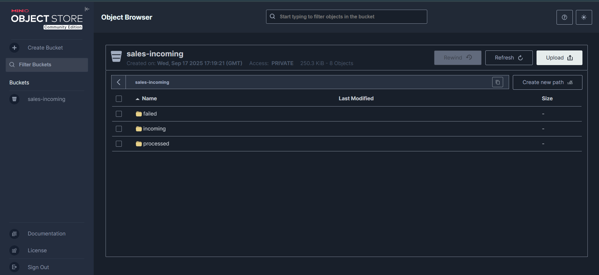

# Mini Data Platform
[](https://opensource.org/licenses/MIT)
[](https://docs.docker.com/compose/)
[](https://airflow.apache.org/)
[](https://www.postgresql.org/)
[](https://www.python.org/)

This project implements a **fault-tolerant data ingestion pipeline** with the following stack:

- **MinIO**: Object storage for incoming, processed, and failed data files (S3-compatible).
- **Postgres**: Data warehouse for cleaned and deduplicated sales data.
- **Apache Airflow**: Orchestration engine that manages ingestion, validation, processing, and loading pipelines.
- **Metabase**: Business intelligence dashboard for reporting and visualization.

---


## Project Structure

```
mini-data-platform/
├── dags/
│   ├── src/
│       ├── __init__.py
│       ├── config.py                      # Configuration (env-driven)
│       ├── minio_client.py                # MinIO utilities (upload, download, list, move)
│       ├── validator.py                   # Validation utilities for CSV, JSON, Parquet
│       ├── processor.py                   # Cleans and deduplicates DataFrames
│       ├── db.py                          # Postgres helpers (upsert + file ingestion log)
│       └── generator.py                   # Synthetic data generator (for testing)
│   ├── process_sales_dags.py              # Airflow DAG definition
├── diagram/
│   └── architecture.png              # Architecture Diagram
├── docker/
│   └── docker-compose.yml            # Container Orchestration
├── imgs/
│   └── screenshots.png               # Screenshots of project running
├── sql/
│   └── create_tables.sql             # Creates sales and file_ingestion_log tables
├── data/
│   └── sales.csv                     # Containes generated csv data
└── README.md                         # Project documentation
│   ├──requirements.txt               # packages requirements

```

---

## Features

- **Sensor-driven orchestration**: DAG waits until new files arrive in `incoming/` MinIO prefix.
- **Format handling**: Supports CSV, JSON, and Parquet.
- **Validation**: Detects format, ensures schema compliance, parses dates/numerics.
- **Fault tolerance**:
  - Branch logic: invalid files -> quarantine in `failed/validation_failed/`.
  - Processing errors -> move to `failed/processing_failed/`.
  - Load failures -> move to `failed/loading_failed/`.
- **Postgres ingestion**: Deduplicates by `sale_id`, upserts new and updated rows.
- **Audit log**: `file_ingestion_log` tracks every file, status, rows processed, and errors.
- **Metabase**: Visualizes sales metrics (daily totals, product breakdowns, revenue trends).

---

## Setup Instructions

### 1. Clone repository
```bash
git clone <your-repo-url> mini-data-platform
cd mini-data-platform
```

### 2. Configure environment
Create a `.env` file:
```env
# Postgres
POSTGRES_USER=postgres
POSTGRES_PASSWORD=postgrespass007
POSTGRES_DB=sales_db
POSTGRES_HOST=postgres
POSTGRES_PORT=5432

# MinIO
MINIO_ACCESS_KEY=minioadmin
MINIO_SECRET_KEY=minioadmin
MINIO_BUCKET=sales-incoming
MINIO_ENDPOINT=http://minio:9000
```

## Minio Service



## Postgres Service


### 3. Start services
```bash
docker-compose up -d
```

Services:
- MinIO console → http://localhost:9001 (login: minioadmin / minioadmin)
- Postgres → localhost:5432
- Metabase → http://localhost:3000
- Airflow → http://localhost:8080 (login: airflow / airflow)

### 4. Initialize database
```bash
docker exec -i $(docker ps -qf "name=postgres") psql -U postgres -d sales_db < sql/create_tables.sql
```

### 5. Install Python dependencies in Airflow container
```bash
docker exec -it airflow bash
pip install -r /opt/airflow/requirements.txt
exit
```

### 6. Run DAG
- Go to Airflow UI: http://localhost:8080
- Trigger DAG: `industrial_sales_ingest`
- Upload a test file to MinIO bucket (`sales-incoming/incoming/`)
- Watch pipeline validate, process, and load data


### 7. Visualize in Metabase
- Connect Metabase to Postgres (`postgres:5432`, db: `sales_db`)
- Explore dashboards: revenue by day, by product, by customer

---


## Example KPIs for Metabase

- **Total sales amount by day**
- **Top 10 customers by revenue**
- **Product category performance**
- **Rolling 7-day average sales**
- **Failed ingestion files trend** (from `file_ingestion_log`)

---

## Fault Tolerance

The DAG is designed to be **robust against failures**:
- **Validation failed** → file moved to `failed/validation_failed/`
- **Processing failed** → file moved to `failed/processing_failed/`
- **Loading failed** → file moved to `failed/loading_failed/`
- **Retries** → configurable retries for network and DB operations
- **Audit log** → tracks all statuses for traceability

---

## Testing

1. Generate synthetic test data:
```bash
docker exec -it airflow python -m src.generator
```
This uploads random sales CSV into MinIO.

2. Upload manually via MinIO console (http://localhost:9001).

3. Trigger DAG and verify data lands in Postgres.

---

## Future Improvements

- Add **unit tests** with pytest for validator/processor modules.
- Add **schema registry** for strict schema validation.
- Add **data quality checks** (null ratios, ranges, anomalies).
- Add **Prometheus metrics + Grafana dashboards**.
- Add **reprocessing DAG** for failed files.

---


## Performance & Scalability
- Handles **10k rows/min**
- Supports files up to **50MB**
- Can scale via **Airflow CeleryExecutor**, **Postgres replicas**, **MinIO cluster**

---

## Security
- Access control for Postgres/MinIO/Airflow/Metabase
- Environment variables in `.env`
- Encryption at rest + in transit (TLS support)

---

## Future Enhancements
- Real-time ingestion via Kafka
- Data quality monitoring
- Automated anomaly detection
- Grafana/Prometheus integration

---

## Contributing
1. Fork the repo
2. Create a feature branch
3. Commit and push changes
4. Create a pull request

Follow **PEP8**, include docstrings, and tests.

---

## License
MIT License – free to use and modify.

---

## Contact
**Kwame Boateng**  
📧 Email: kayboateng@gmail.com  
🔗 LinkedIn: [linkedin.com/in/kwameboateng](https://linkedin.com/in/kwameboateng)  
🐙 GitHub: [@kwameboateng](https://github.com/kwameboateng)

---

## Maintainer

Built by **Kwame Boateng**  
For questions, contact: kayboateng@gmail.com

---

## License

MIT License – free to use and modify.
